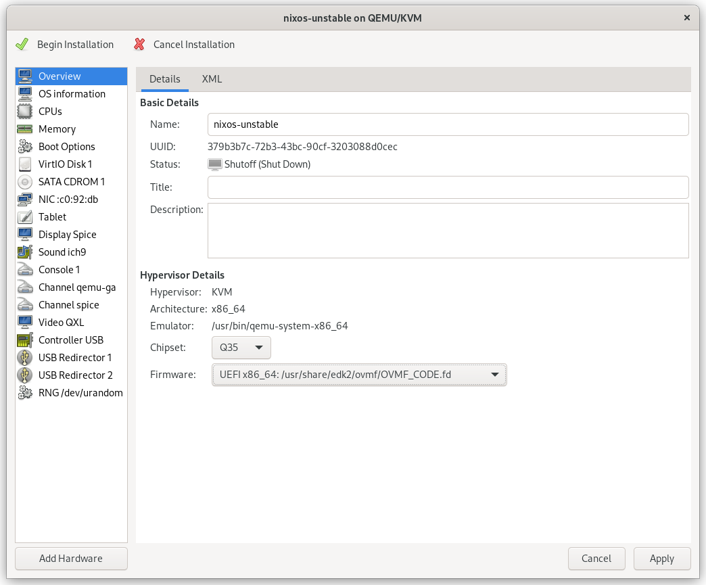
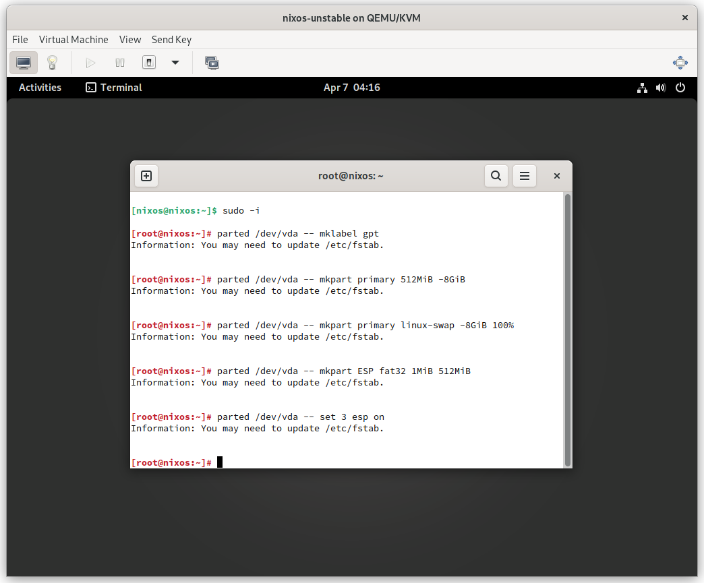
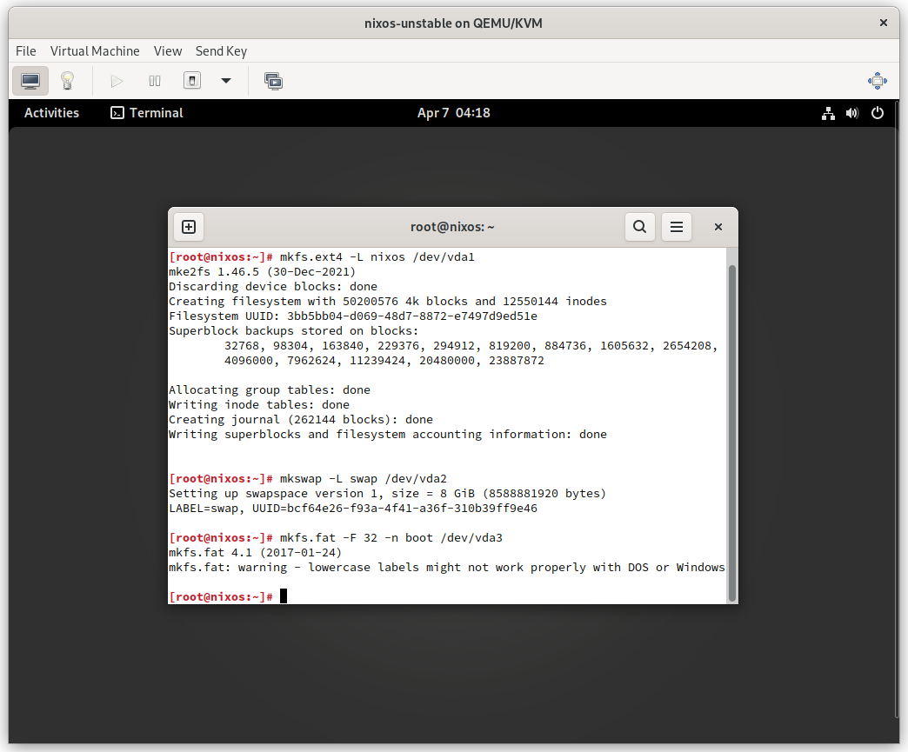
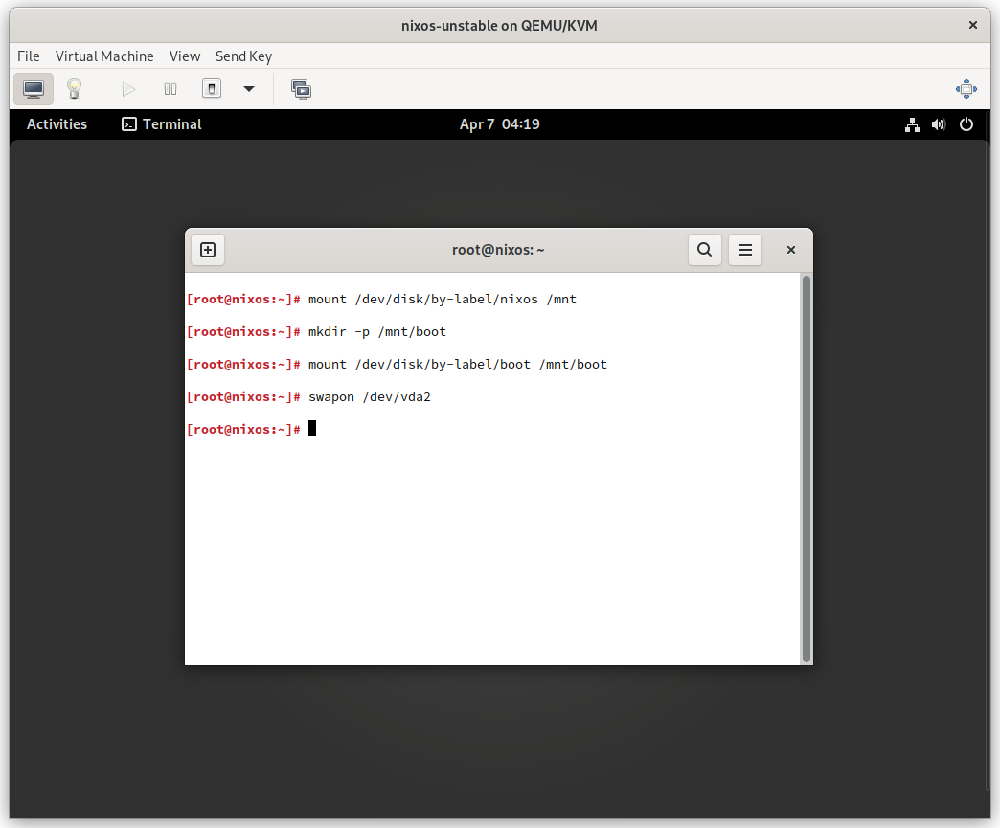
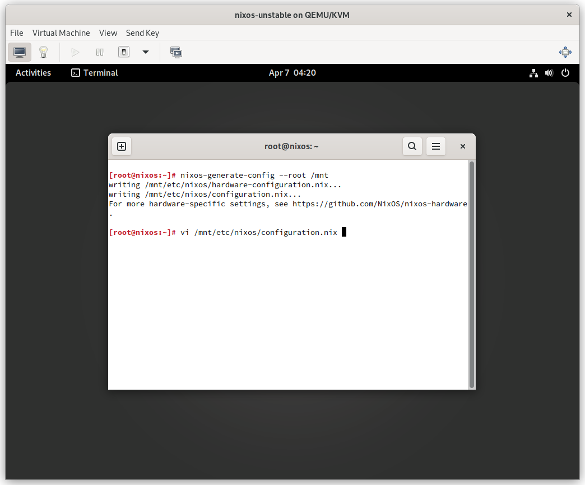
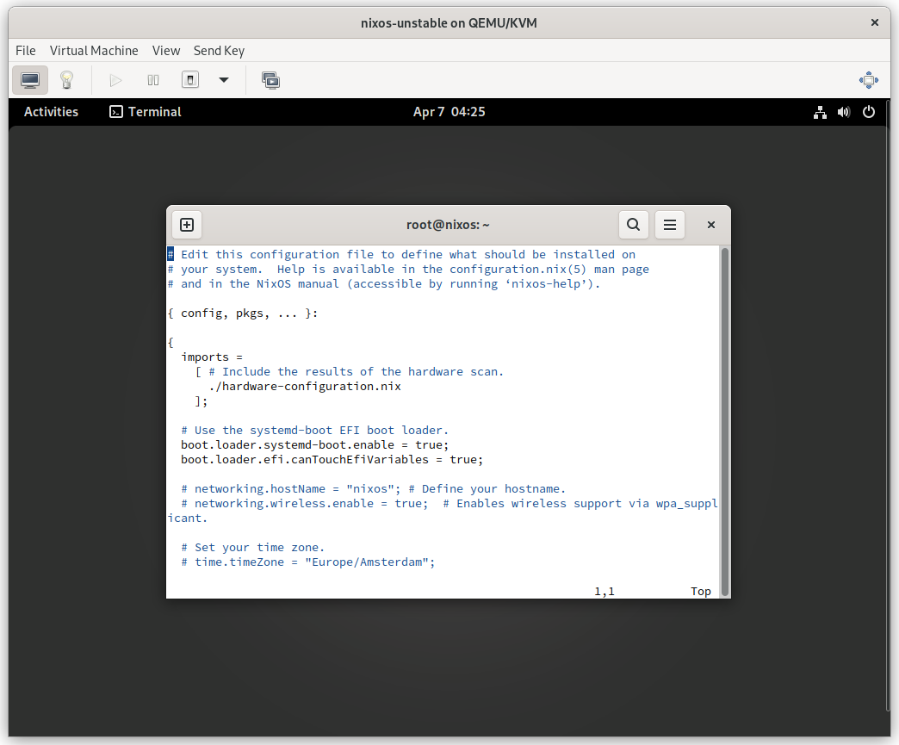
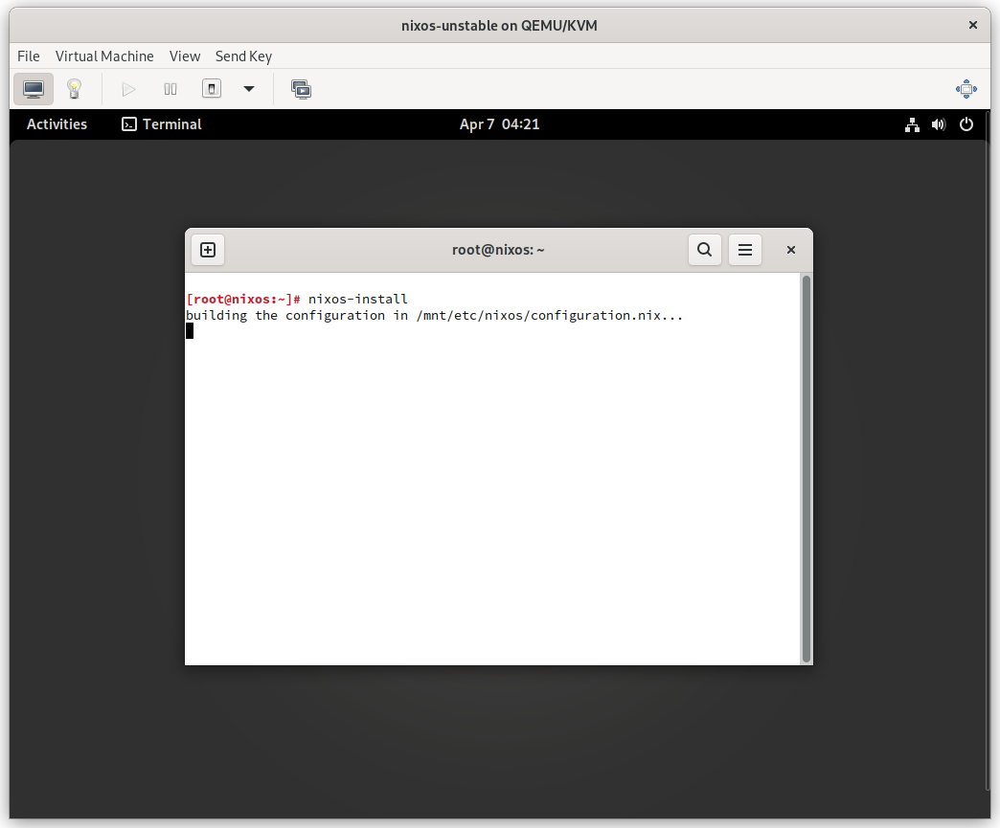
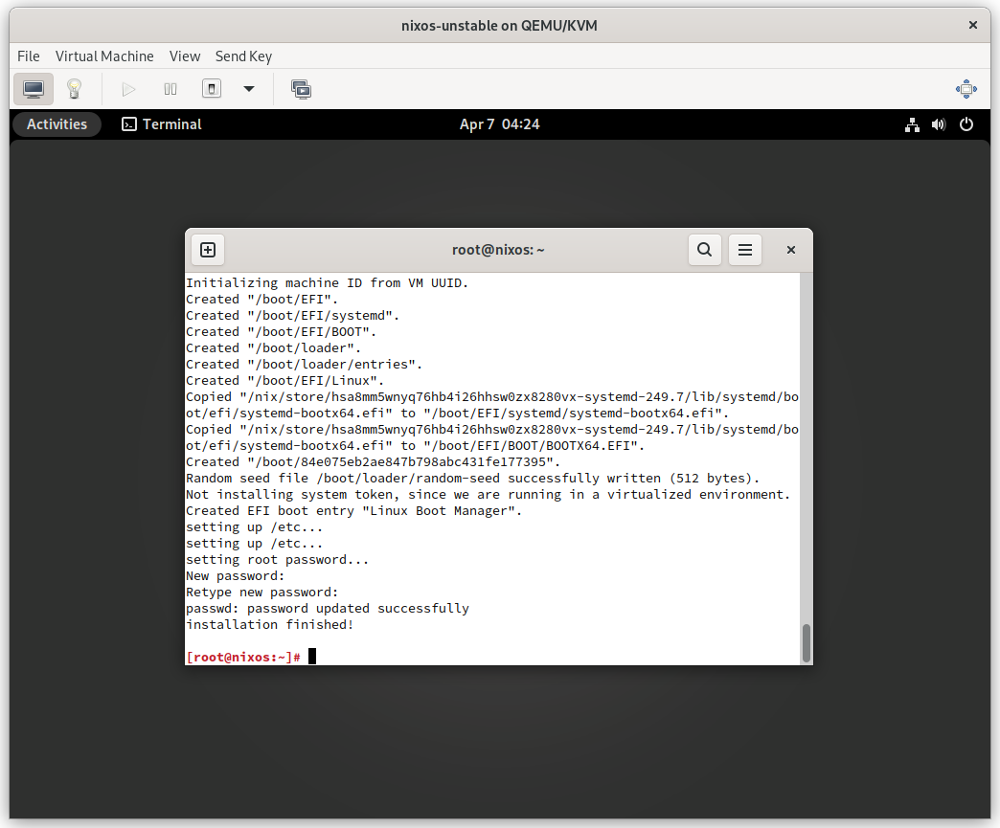

# Virtual Machine Manager Settings
Choose `UEFI` with no secure boot



# Partitioning
```sh
sudo -i
```

```sh
parted /dev/vda -- mklabel gpt
parted /dev/vda -- mkpart primary 512MiB -8GiB
parted /dev/vda -- mkpart primary linux-swap -8GiB 100%
```



# Formatting
```sh
mkfs.ext4 -L nixos /dev/vda1
mkswap -L swap /dev/vda2
mkfs.fat -F 32 -n boot /dev/vda3
```



# Mounting
```sh
mount /dev/disk/by-label/nixos /mnt
mount /dev/disk/by-label/boot /mnt/boot
swapon /dev/vda2
```



# Configuring
```sh
nixos-generate-config --root /mnt
vi /mnt/etc/nixos/configuration.nix
```




# Installing
```sh
nixos-install
```



# Success
Install finish reboot into the newly installed NixOS
```sh
reboot
```



# Reference
https://nixos.org/manual/nixos/stable/index.html#ch-installation
